  

  

  
  
  

 

  

 

Soy **Tecnólogo en Desarrollo de Software**, estudiante activo de **Ingeniería de Sistemas y Computación** y **Desarrollador Full-Stack**, enfocado en construir soluciones completas, robustas, escalables y bien documentadas: desde la base de datos y el backend hasta una interfaz clara y profesional.

- 🏗️ Soy **Full-Stack**: desarrollo el **backend** con Python (Django, Flask, FastAPI) y el **frontend** con HTML, CSS y JavaScript, cuidando el diseño y la experiencia de usuario.
- 🔧 Me especializo en **desarrollo backend**, **arquitectura de software** y **optimización de sistemas**, priorizando código limpio, mantenible y eficiente.
- 📚 Tengo un fuerte enfoque en **investigación técnica** y la creación de **documentación rigurosa**: manuales de usuario, especificaciones técnicas, y gestión de sistemas de mantenimiento y software.
- 🤖 Trabajo activamente con **Inteligencia Artificial aplicada al desarrollo**, integrando IA de forma responsable en flujos de trabajo reales.
- 🌐 Dominio profesional de **español e inglés**, lo que me permite colaborar en equipos y proyectos internacionales sin fricción.
- 🤝 Me destaco por el **trabajo en equipo**, la **resolución analítica de problemas** y la capacidad de trabajar de forma **autónoma** cuando el proyecto lo requiere.

 

  

### ⚓ COTECMAR · Prácticas profesionales
*Corporación de Ciencia y Tecnología para el Desarrollo de la Industria Naval, Marítima y Fluvial, Cartagena*

Aporté en el **soporte y desarrollo del software de gestión naval** de la corporación:
- Soporte técnico del sistema de gestión y atención a sus usuarios.
- Desarrollo de mejoras y nuevas funcionalidades.
- Documentación técnica de los procesos atendidos.

 

<table>
<tr>
<td width="50%" valign="top">

### ✂️ [MAGNUS Barber System](https://github.com/Sebaspuerta/MAGNUS-PROJECTO)
Sistema local de gestión para **MAGNUS Barber Shop**: control de barberos, clientes, servicios, comandas, inventario, caja, reportes y seguridad.

- Proyecto **full-stack**: backend en FastAPI + SQLAlchemy y frontend en HTML, CSS y JavaScript
- **11 módulos** y **12 pantallas** con diseño propio alineado a la marca
- Reportes gerenciales en **Excel** con identidad corporativa
- Entrega como **instalador de Windows** (`.exe`) listo para usar

</td>
<td width="50%" valign="top">

### ⛏️ [Minecraft Server](https://github.com/Sebaspuerta/Minecraft_server)
Servidor de Minecraft **Java + Bedrock** gratis, con lobby, kit automático, plugin propio y despliegue en **AWS**.

- **Crossplay** PC, móvil y consola (PaperMC + Geyser)
- Lobby personalizado, kit automático y **plugin propio**
- Despliegue en **AWS EC2**, en línea **24/7**
- Instalación reproducible con scripts de automatización

</td>
</tr>
</table>

 

**Lenguajes**

**Frameworks, Backend y Herramientas**

**Bases de Datos**

**Cloud**

**Mobile** · *manejo básico*

 

  
  
  
  
  
  

Mi especialización combina el **uso correcto y ético de la IA** en el ciclo de desarrollo, la aplicación de **prompt engineering** avanzado y el diseño de **flujos RAG (Retrieval-Augmented Generation)**, junto con la **automatización de procesos** técnicos. Todo esto respaldado por un enfoque riguroso en **investigación** y **documentación** de proyectos tecnológicos, garantizando trazabilidad, calidad y mantenibilidad a largo plazo.

 

  

 

**Sebastián Enrique Puerta Fernández** · Cartagena de Indias, Colombia

📧 [sebastianpuertafernandez@gmail.com](mailto:sebastianpuertafernandez@gmail.com) &nbsp;·&nbsp; 📱 [+57 301 761 4745](https://wa.me/573017614745) &nbsp;·&nbsp; 💼 [LinkedIn](https://www.linkedin.com/in/sebastian-puerta-b8475240a/)

  

